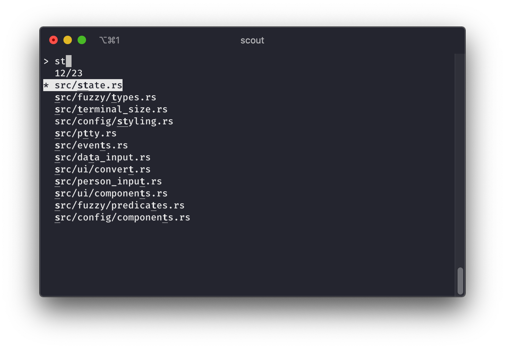
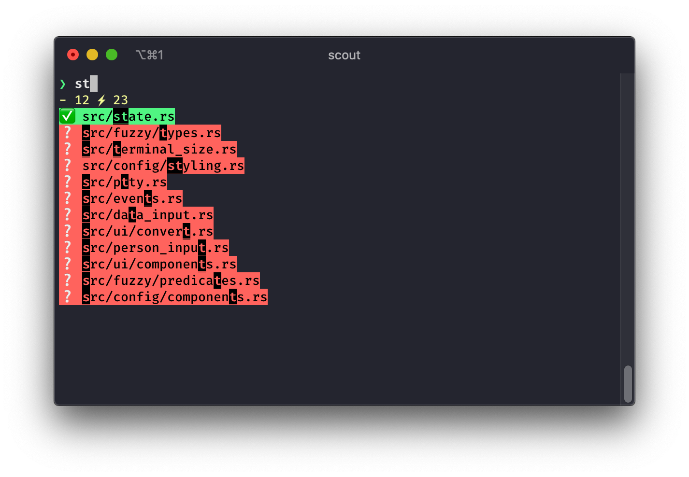

# Scout

[](https://travis-ci.org/jhbabon/scout)

Scout is a small fuzzy finder for your terminal built in [Rust][rustlang].

<p align="center">
  
</p>

It is heavily inspired by other tools like [selecta][selecta] and the omnipresent [fzf][fzf].

The main features of `scout` are:

* Async architecture thanks to the [`async-std`][asyncstd] library. This means that it won't block the UI to wait for the `STDIN` to finish, you can start typing right away.
* Customizable UI. You can change the colors and symbols of all the elements in the UI.
* Fast fuzzy matching algorithm based on the [`fuzzaldrin-plug`][fuzzaldrin-plus] package used in the Atom editor.

## WARNING

This tool uses the system's pseudo terminal located in `/dev/tty` to print the UI and capture inputs, which means it only works on UNIX systems (like Linux or macOS) as far as I know.

## Installation

### Install via release packages

Each release, since version `v1.0.0` (not included), has a package with `scout` compiled for different architectures. You can try to donwload and install the package that match your architecture.

You can find the releases in their [GitHub page][github-releases].

### Install via cargo

Scout is in the main [crates][] repository, so you can install it with `cargo`:

```
$ cargo install scout
```

Remember to put `cargo` bin path to the main `$PATH` env variable:

```
export PATH=$PATH:~/.cargo/bin
```

### Install via homebrew (macOS only)

You can use my custom tap repository to install `scout` with [homebrew](https://brew.sh):

```
$ brew tap jhbabon/tap
$ brew install scout
```

### Install from source

Since `scout` is a Rust project, you will need to have Rust installed in your system. Check [`rustup`][rustup] to see how to install Rust. To build `scout` you will need Rust `v1.43` or higher.

Clone the repository and run `cargo install` from it:

```
$ git clone https://github.com/jhbabon/scout.git path/to/scout
$ cd path/to/scout
$ cargo install --path .
```

You can also run `cargo build --release` if you just want to play with it. The binary file will be in the `./target/release/scout` path.

## Usage

The main idea behind `scout`, or any other fuzzy finder, is to filter a list of items (for example a list of paths to files) and then do something with the selection. For that you run a command, pipe its output to `scout` and then pipe `scout`'s output to another command.

For example, you can try to find a file and `cat` its contents:

```
$ find * -type f | scout | cat
```

`scout` has a set of options that allows you to control how it looks. It also supports a set of control sequences and keys to navigate the UI.

You can see these options in the main help of the program with the `--help` flag:

```
scout 2.0.0
Your friendly fuzzy finder

USAGE:
    scout [FLAGS] [OPTIONS]

FLAGS:
    -f, --full-screen    Show scout in full screen (default)
    -h, --help           Prints help information
    -i, --inline         Show scout under the current line
    -V, --version        Prints version information

OPTIONS:
    -c, --config <FILE>     Uses a custom config file
    -l, --lines <LINES>     Number of lines to display in inline mode, including prompt
    -s, --search <QUERY>    Start searching with the given query

SUPPORTED KEYS:
    - Enter to select the current highlighted match and print it to STDOUT
    - ^u to clear the prompt
    - ^n or Down arrow key to select the next match
    - ^p or Up arrow key to select the previous match
    - ^e to go to the end of the prompt
    - ^a to go to the beginning of the prompt
    - Left arrow key to move the cursor to the left in the prompt
    - Right arrow key to move the cursor to the right in the prompt
    - ESC to quit without selecting a match

EXAMPLE:
    $ find * -type f | scout

    # Pass an initial query to start filtering right away
    $ find * -type f | scout --search=foo

    # Use a custom config file
    $ find * -type f | scout --config="./config.toml"

    # Select a git branch and check it out with an inline menu
    $ git branch | cut -c 3- | scout -i | xargs git checkout
```

### Configuration

You can configure `scout`'s UI with a config file. By default the program will try to find this file in the path `$HOME/.config/scout.toml`, but you can pass a custom path with the `--config` option.

This is how `scout` looks like without any defined style:



This is an example of a configuration file with all the possible settings:

```toml
# General screen options
[screen]
# Display inline (under the current line) or in full screen
mode = "inline" # or "full"
# Max number of lines to display the whole UI. Only used in inline mode
lines = 8

# The prompt is where you type your query
[prompt]
# Symbol displayed before the text you will type
symbol = "❯ "
# Style for the query (your text)
style = "bold underline"
# Style for the symbol
style_symbol = "fg:green"

# The gauge indicates the number of matches vs total number of lines
[gauge]
# Symbol used to separate both numbers
symbol = " ⚡"
# Text before the numbers
prefix = "- "
# Style for the numbers
style = "fg:bright-yellow"

# A candidate is an item in the list that is not selected
[candidate]
# Symbol displayed before the candidate's text
symbol = "❔ "
# Style for the candidate's text
style = "bg:red fg:black"
# Style for the symbol
style_symbol = "bg:red"
# A match is a character that is in both the query and the candidate
style_match = "underline bg:black fg:red bold"

# The selected candidate
[selection]
# Symbol displayed before the selection's text
symbol = "✅ "
# Style for the selection's text
style = "bg:green fg:black"
# Style for the symbol
style_symbol = "bg:green"
# A match is a character that is in both the query and the selection
style_match = "underline fg:bright-green bg:black"
```

That configuration placed in the `$HOME/.config/scout.toml` would generate this UI:



It is not the prettiest, but it is just an example of what you can do.

A style is defined with a `string` of space separated values. I ~~copied~~ based the syntax on [starship.rs][starship] configuration system.

These are the possible values you can use to define a style:

* `underline`: Put a line under the text
* `strikethrough`: Cross the text with a line
* `reverse`: Reverse the current terminal colors
* `bold`: Use bold font
* `italic`: Use italic font (if the terminal supports it)
* `dimmed`: Fade the foreground color a bit
* `none`: Reset any color, using terminal's defaults. This will ignore any other rule in the style definition
* `fg:<color-name>`: Use the named color as foreground (text) color. Possible names are `black`, `red`, `yellow`, `green`, `blue`, `purple`, `cyan`, `white`. You can also use their bright version with the `bright-*` prefix
* `fg:<number>`: Use the given [ANSI Color][ansi-color] number as the foreground color
* `fg:#<hex>`: Use the given hexadecimal representation of an RGB color as the foreground color. For example `fg:#ffbbcc` would be  `rgb(255, 187, 204)`
* `bg:<color-name>`: Same as with `fg:` but for the background
* `bg:<number>`: Same as with `fg:` but for the background
* `bg:#<hex>`: Same as with `fg:` but for the background

For color setting it really depends on your terminal color capabilities. Most modern terminals allow you to set any color, though.

## Fuzzy matching algorithm

You can learn more about the fuzzy matching algorithm in the `README` in the repository page of the  [`fuzzaldrin-plug`][fuzzaldrin-plus] package. The only missing part from that algorithm is the path scoring bonus.

From all the algorithms for fuzzy matching out there this is one of the most complete I found, so I decided to try to port it.

## Development

Check the [contributing][contributing] guidelines.

## Neovim integration

One of the main reasons I've built this was to have a general purpose fuzzy finder I could use inside [Neovim][]. If you want to do the same you can use my [`scout.vim`][scoutvim] plugin.

## FAQ

##### Is this better than X?

I don't know. Maybe? It really depends on your needs. I built this tool first to learn some Rust and second because I didn't like much other more heavy tools. That doesn't mean is better or worse. It is probably simpler. Give `scout` a try, see if it works for you, and if not try any other tool, it's cool.

##### Is this faster than X?

I don't know, I haven't run any benchmark, to be honest. It is fast enough for me and most probably for most of the people.

##### Is this any good?

Yes.


[rustlang]: https://www.rust-lang.org/
[selecta]: https://github.com/garybernhardt/selecta
[fzf]: https://github.com/junegunn/fzf
[asyncstd]: https://async.rs/
[starship]: https://starship.rs/
[fuzzaldrin-plus]: https://github.com/jeancroy/fuzz-aldrin-plus/
[crates]: https://crates.io/crates/scout
[github-releases]: https://github.com/jhbabon/scout/releases
[rustup]: https://rustup.rs/
[ansi-color]: https://i.stack.imgur.com/KTSQa.png
[rustfmt]: https://github.com/rust-lang/rustfmt
[scoutvim]: https://github.com/jhbabon/scout.vim
[Neovim]: https://neovim.io/
[contributing]: ./CONTRIBUTING.md
